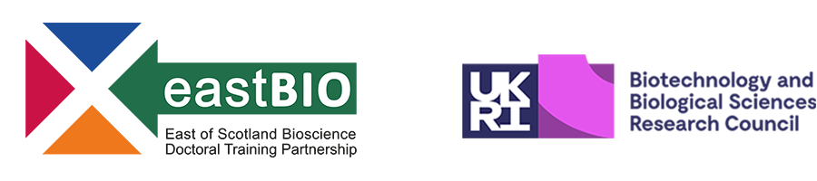

# Bioinformatics: some easy wins and a roadmap to competency.

Talk given for The East of Scotland Bioscience Doctoral Training 
Partnership (EASTBIO) thematic meeting 08-03-2024

Slides: [Bioinformatics: some easy wins and a roadmap to competency](https://3mmarand.github.io/eastbio-data-skills/)

Licensed under a <a rel="license" href="http://creativecommons.org/licenses/by-nc-sa/4.0/">Creative Commons Attribution-NonCommercial-ShareAlike 4.0 International License</a>.
 

## Summary

## Learning Objectives

by the end of this session you will able to:

